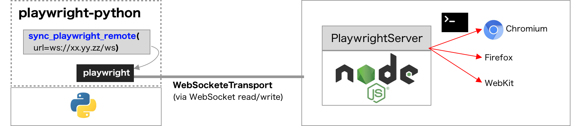

# playwright-remote

Enables us to execute [playwright-python](https://github.com/microsoft/playwright-python) scripts on **Pure-Python environment**.



## Setup

```
pip install playwright-remote
```

## Example

```py
from playwright_remote.sync_api import sync_playwright_remote

with sync_playwright_remote('ws://127.0.0.1:8080/ws') as playwright:
    with playwright.chromium.launch() as browser:
        page = browser.new_page()
        page.goto('https://github.com/YusukeIwaki')
        page.screenshot(path='YusukeIwaki.png')
```

### Launch Playwright server

Note that we have to prepare Playwright server using playwright CLI.

In local development environment (Node.js is required), just execute:

```
npx playwright@1.12.3 install && npx playwright@1.12.3 run-server
```

For deploying to PaaS servers, we can use Playwright official Docker image: https://hub.docker.com/_/microsoft-playwright

```Dockerfile
FROM mcr.microsoft.com/playwright:focal

WORKDIR /root
RUN npm install playwright@1.12.3 && ./node_modules/.bin/playwright install
CMD ["./node_modules/.bin/playwright", "run-server"]
```
